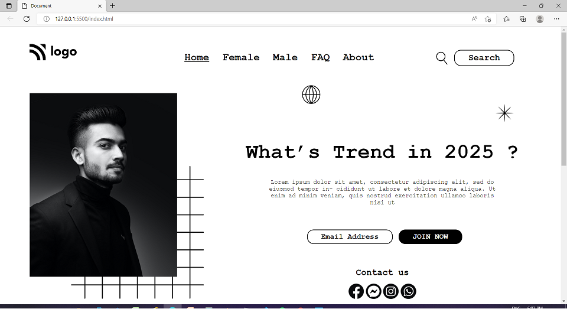

# Project-01 - Hero-Portfolio-Page

## Description:

> A basic portfolio page, made without using Bootstrap or Flexbox-related CSS properties but by using Position CSS property.

# 

**Landing-Page-Image:**

#

## What I have learnt while making this project?

> Although, I had learned about Position property few years ago, but only at a basic level, and then started using bootstrap, so never was able to get a hands-on knowledge on Postion CSS property. So, by creating this project which I have developed using only Position property and without using Flexbox CSS concept and the bootstrap, it was a big challenge for me and it has equipped me with a better understanding of how to use and work with Position property.

#

## Time taken to complete this project:
> Around 11hrs, spread over the last few days.

#

## See this project in action at below link:

[Click to redirect to Project-01](https://p1-hero-portfolio.netlify.app/)

#

## Developed by:
**Sidharth Pandey**

**[Contact Me](mailto:sidp0008@gmail.com)**